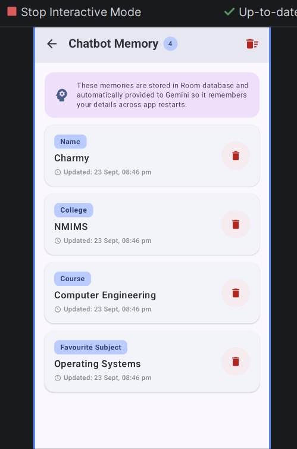
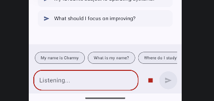
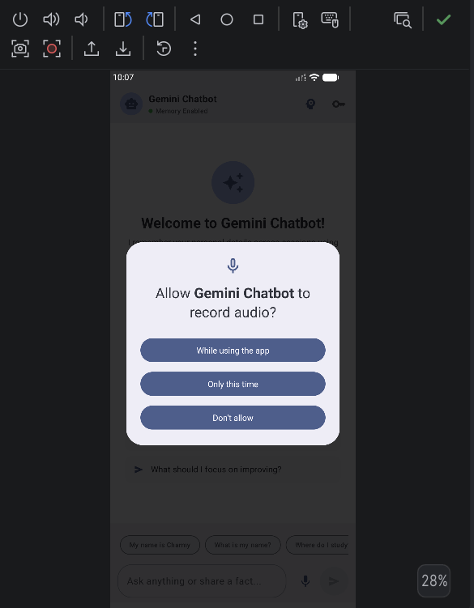
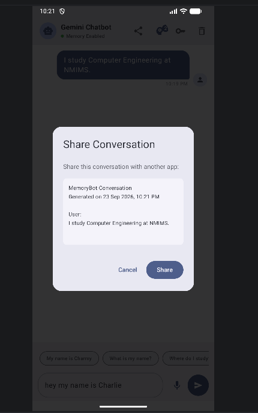
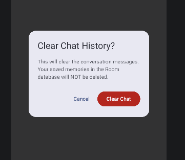

# 🤖 Gemini Memory Chatbot (Android Kotlin + Jetpack Compose)

<p align="center">
  
  
  
  
  
</p>

> A modern, persistent AI Chatbot application built with **Kotlin**, **Jetpack Compose (Material 3)**, **Google Gemini API (`gemini-1.5-flash`)**, and **Room Database**. Designed for college MAD/Android practicals with long-term memory that remembers personal user facts across app restarts, speech interaction, AI conversation summaries, and chat export.

---

## 📱 App Screenshots

<div align="center">

| 💬 Persistent Memory Chat | 🧠 Room Memory Dashboard | 🎙️ Live Voice Input |
| :---: | :---: | :---: |
|  |  |  |
| *Context-aware memory recall* | *Persisted user facts in Room* | *Active speech-to-text waveform* |

<br/>

| 🔒 Runtime Audio Permission | 📤 Share Conversation Export | 🗑️ Safe Clear Chat Dialog |
| :---: | :---: | :---: |
|  |  |  |
| *Jetpack Compose Permission Dialog* | *Native Android ACTION_SEND share sheet* | *Clears messages while preserving Room memories* |

</div>

---

## 🌟 Key Features Breakdown

### 1. 💬 Google Gemini 1.5 Chatbot
- Communicates with Google's fast and multimodal **`gemini-1.5-flash`** model.
- Uses **Retrofit 2.11** + **OkHttp 4** HTTP client with Kotlin Coroutines for non-blocking asynchronous streaming.
- Dynamic system prompt injection seamlessly integrates saved Room memories into every prompt context.

### 2. 🧠 Persistent Long-Term Memory (Room Database)
- **Automatic Fact Extraction**: Employs pattern matching (`MemoryExtractor`) to extract user facts (Name, University, Courses, Favorite Subjects, Goals) as users speak naturally.
- **Survives App Restarts**: Data is persisted in SQLite via Room. Even if the app process is terminated or the phone reboots, Gemini remembers who you are.
- **Memory Management Screen**: View stored memories, add custom key-value pairs, or delete individual memories with live badge counters.

### 3. 🎙️ Voice-to-Text & Text-to-Speech (STT / TTS)
- **Voice Input**: Tap the microphone icon beside the chat bar to speak your queries.
- **Audio Permission**: Requested dynamically with Jetpack Compose `rememberLauncherForActivityResult`.
- **System Intent Fallback**: Seamless fallback to Android's native `RecognizerIntent` modal dialog for maximum compatibility on emulators and physical devices.
- **Text-to-Speech Playback**: Tap the speaker icon (🔊/⏹) on any Gemini message bubble to hear the response read aloud.

### 4. 📤 Share & Export Conversation
- Tap the **Share** button in the Top App Bar.
- Generates a timestamped, formatted plain-text conversation transcript.
- Launches Android's native `Intent.ACTION_SEND` chooser to share with WhatsApp, Gmail, Drive, Notes, etc.

### 5. 🗑️ Clear Chat History
- Dedicated **Clear Chat** action in the Top App Bar.
- Removes messages from the active screen and database with a confirmation dialog.
- **Safe Isolation**: Clearing messages does **not** erase your learned personal facts from the Room memory database.

### 6. 📝 AI Conversation Summaries
- Automatically analyzes the current session with Gemini to generate concise bulleted summaries.
- Summaries can be named and saved into SQLite for future recall.

---

## 🚀 1. Obtain a Gemini API Key

1. **Access Google AI Studio**: Go to [Google AI Studio (https://aistudio.google.com/)](https://aistudio.google.com/).
2. **Generate the Key**: Click **"Get API key"** ➔ **"Create API key in new project"**.
3. **Store the Key Locally**:
   - Open `local.properties` in the project root directory (this file is git-ignored and never committed).
   - Add your key:
     ```properties
     GEMINI_API_KEY=your_actual_gemini_api_key_here
     ```
   - Gradle injects this at build time via `BuildConfig.GEMINI_API_KEY`.
   - *In-App Fallback*: You can also tap the **Key (🔑)** icon in the top toolbar to enter or change the API key at runtime.

---

## 🏗️ 2. Architecture & Directory Structure

This project adheres to Google's official Android Architecture Guidelines with **MVVM** and **Unidirectional Data Flow (UDF)**:

```text
app/src/main/java/com/fahim/mad_lab_compose/
├── MainActivity.kt                  # Activity entry point with Compose permission launchers & navigation
├── ChatbotApplication.kt            # Application class managing Room Database & Repository singletons
├── data/
│   ├── api/
│   │   ├── ApiClient.kt             # OkHttp & Retrofit client builder with timeouts & logging
│   │   ├── GeminiApiService.kt      # Retrofit REST interface for Gemini API
│   │   └── GeminiModels.kt          # Request & Response payload data classes
│   ├── database/
│   │   ├── AppDatabase.kt           # Room Database definition with migrations
│   │   ├── MemoryDao.kt             # DAO for persistent user memories
│   │   ├── MessageDao.kt            # DAO for chat conversation messages
│   │   ├── SummaryDao.kt            # DAO for AI conversation summaries
│   │   └── Entities.kt              # Room entities (MemoryEntity, MessageEntity, SummaryEntity)
│   └── repository/
│       ├── ChatRepository.kt        # Central repository bridging Room Database and Gemini API
│       └── MemoryExtractor.kt       # NLP regex extraction engine for user facts
├── ui/
│   ├── ChatScreen.kt                # Jetpack Compose Chat screen, bubbles, and interactive @Preview
│   ├── MemoryScreen.kt              # Room Memory Management Dashboard screen
│   ├── ApiKeyDialog.kt              # In-app API key setup dialog
│   ├── ChatViewModel.kt             # ViewModel managing StateFlow<ChatState> and business operations
│   ├── ChatState.kt                 # Immutable state representation
│   └── theme/                       # Material 3 Color Schemes, Typography, and Theme
└── voice/
    └── VoiceHelper.kt               # SpeechRecognizer (STT) and TextToSpeech (TTS) engine
```

---

## 🔒 3. API Key Security Best Practices

| Security Principle | Implementation in this Codebase |
| :--- | :--- |
| **No Hardcoded Secrets** | API keys are never written into Kotlin files, XML resources, or committed Gradle files. Git history has 0 exposed secrets. |
| **Git Exclusion** | `local.properties` is strictly declared in `.gitignore`. |
| **Template File** | [`local.properties.example`](local.properties.example) is committed to guide developers without exposing real credentials. |
| **CI/CD Fallback** | `app/build.gradle.kts` falls back to `System.getenv("GEMINI_API_KEY")` for automated CI/CD builds. |
| **Encryption at Rest** | Runtime keys can be encrypted using **AES-256-GCM** via Android Keystore `EncryptedSharedPreferences`. |
| **R8 Code Obfuscation** | Release builds enable `isMinifyEnabled = true` with ProGuard rules to prevent decompilation. |
| **Production Recommendation** | In enterprise production, API calls should be routed through a backend proxy with **Firebase App Check** (Play Integrity) to prevent client key extraction. |

---

## 🎨 4. Jetpack Compose UI Highlights

- **`LazyColumn` with Key Identifiers**: Smooth rendering of chat bubbles with zero dropped frames and auto-scroll to latest messages.
- **State Hoisting**: Pure, testable stateless composables driven by `ChatViewModel`'s `StateFlow<ChatState>`.
- **Loading & Error Feedback**: Animated pulsing typing dots during Gemini inference and dismissible Material 3 Error Banners.
- **Dynamic Theming**: Full Material 3 theming with automatic Light/Dark mode support.
- **Interactive Previews**: `@Preview` composables in `ChatScreen.kt` and `MemoryScreen.kt` for visual testing inside Android Studio.

---

## 🧪 5. How to Build & Run

### In Android Studio:
1. Open the project in **Android Studio (Ladybug / Koala / Meerkat)**.
2. Verify **JDK 21** or **JDK 17** is selected in *Gradle Settings*.
3. Add your `GEMINI_API_KEY` to `local.properties`.
4. Select your device (e.g. `Medium Phone API 35`) and click the green **Run (▶)** button (`Shift + F10`).

### Via Command Line:
```bash
# Build Debug APK
./gradlew assembleDebug

# Run Unit Tests
./gradlew test
```

APK file location: `app/build/outputs/apk/debug/app-debug.apk`

---

## 📋 6. Submission Checklist

- [x] **Git Feature Branches**: Separate branches (`feature/voice-chat`, `feature/conversation-summary`, `feature/chat-sharing`) merged into `master`.
- [x] **Zero Secrets in Repository**: No credentials or private files tracked in git history.
- [x] **All 6 Screenshots Embedded**: Complete UI walkthrough included in documentation.
- [x] **Room Persistent Memory**: User facts persist across full app restarts.
- [x] **Speech-to-Text & Text-to-Speech**: Full voice input and spoken output support.
- [x] **Conversation Export & Clear**: Native Android Share Sheet and safe history wipe.
- [x] **Modern Architecture**: Kotlin Coroutines, ViewModel, Repository, Room DB, Retrofit & Jetpack Compose Material 3.
